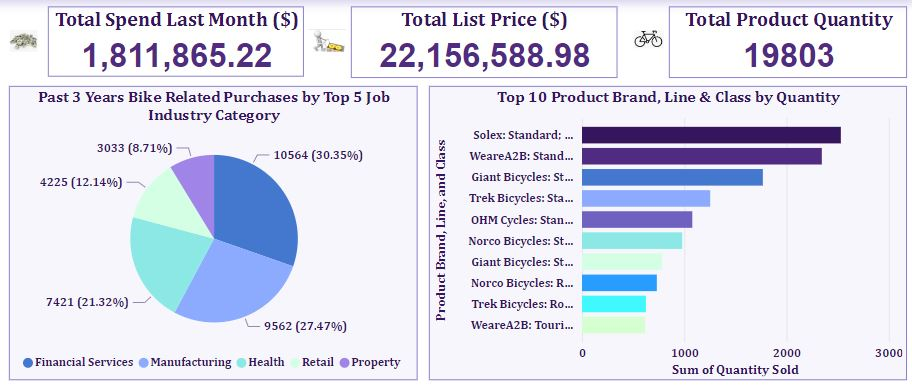

# Sprocket_Central_Pty_Ltd_Marketing_Dashboards
This visualization project showcases an analysis of clients' customer and transaction data to help optimize its marketing strategy.

Aim: The client, "Sprocket Central Pty Ltd", a medium-sized bike and cycling accessories organization, needed to effectively analyze its’ customer and transaction data to help optimize its marketing strategy.

After being provided with three datasets, namely: customer demographics, customer addresses, and transaction data,

Tasks:

1. Assessment of data quality and completeness in preparation for analysis
2. Targeting high-value customers based on customer demographics and attributes
3. Using visualizations to present insights

Thereafter, two amazing financial marketing and summary dashboards were created for the client, and several trends in the underlying data were shown; financial metrics and KPIs were generated; top product brands, lines, and classes were shown; and a monthly trend for the monthly list price was shown. Furthermore, the customer segment with the highest customer value was shown, proposals were made for Sprocket Central Pty Ltd’s marketing and growth strategy, and greater insights were drafted from visualizations into customer preferences and propensity to purchase the products.

.

Data-informed insights and decisions for Sprocket Central Pty Ltd ’s growth and improvement in moving forward the sales of bikes & cycling accessories and for effective marketing
are explained here.

A. FINANCIALS
. The Total List Price was $22,156,588 

. The Total Amount Spend for the Last Month December, 2017 was $1,811,865

. The Total Product Quantity sold for Bike and other cycling accesories was 19803

. The Top 5 Job Industry Category with the highest number of purchases in the past 3 years were the Financial services 10564 (30.35%), Manufacturing 9562 (27.47%), Health 7421 (21.32%), Retail 4225 (12.14%), and Property 3033 (8.71%)

. The month of October has the highest list price $1,962,655 and september has the lowest list price $1,744,175

B. MARKETING SUMMARY
· There are 513 (51.3%) Female customers, 470 (47%) Male customers, and 17 (1.7%) Unknown-gender customers, this shows an almost even customer distribution between female
and male customers.

· There were 9 unique (distinct) job categories Sprocket Central Pty Ltd's customers belonged to with the financial services, manufacturing, and health being the top 3.

· The wealth segment customer category has 3 distinct characteristics decreasing from Mass customers 508 (50.8%) to High-net-worth customers 251 (25.1%) and Affluent
customers 241 (24.1%).

· 493 (49.3%) of the customers who purchase bikes and cycling accessories from Sprocket Central had a car while 503 (50.3%) do not own a car.

· All customers were from Australia and from 3 different states with NSW having half quota 506 (50.6%), VIC 266 (26.6%), and QLD 228 (22.8%).

· The highest property valuation for customers was 12 (7. 46% of total customers) and the lowest was 1. Majority of customers had property valuation as 9 (21.05%).

· Lastly, age-group 41-50 had the highest percentage of customers being 22.4%, followed by age- group 51-60 (17.4%).

The Customer segment with the highest customer value is the Mass Customer (50.97%).

This virtual internship program exposed me to many different skills, such as data analysis, data cleaning, data modeling, data visualization, problem solving, design thinking, data presentation, and more!

# Download pdf. and pbix. file for the detailed and comprehensive report
